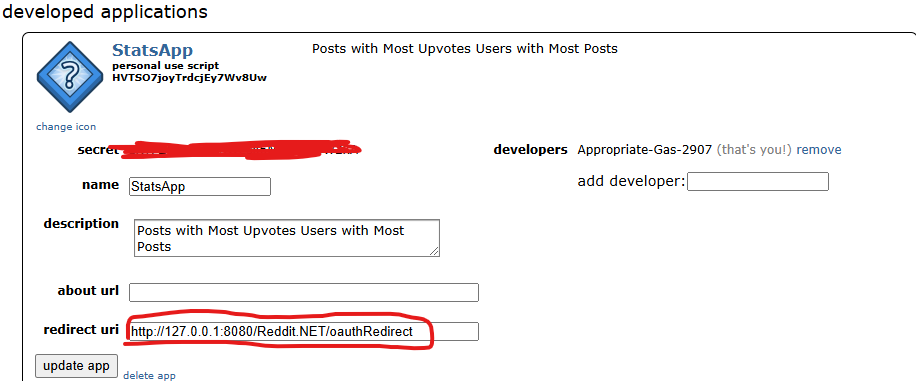

# Reddit Stats App

This application monitors a specified subreddit and reports statistics on posts and users.

## Setup

1. Clone the repository.
2. Navigate to the project directory.
3. Run the application using `dotnet run`.

## Usage

Enter the name of the subreddit you want to monitor when prompted.
